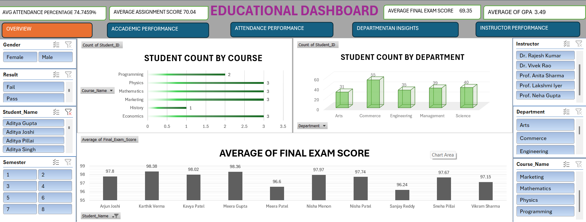
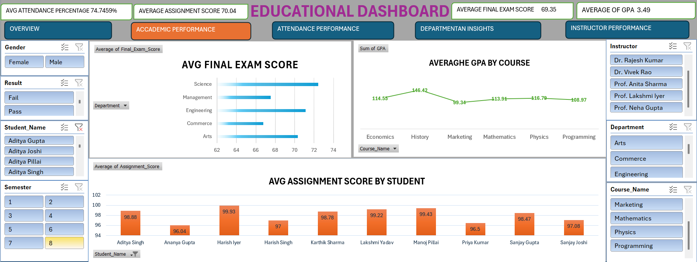
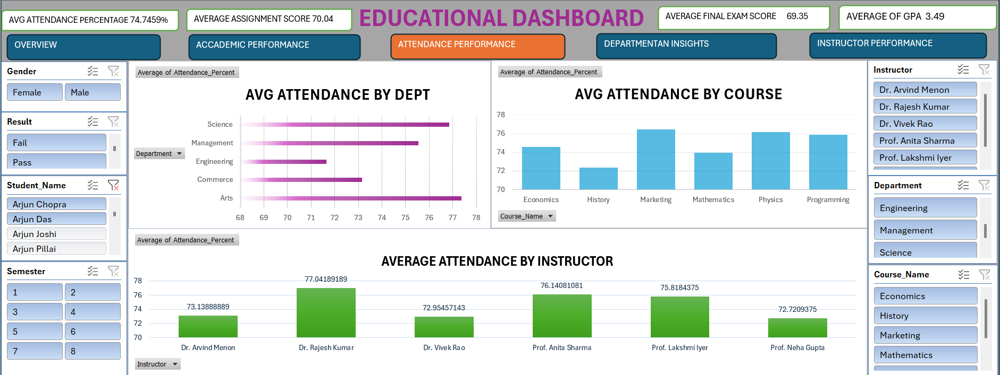
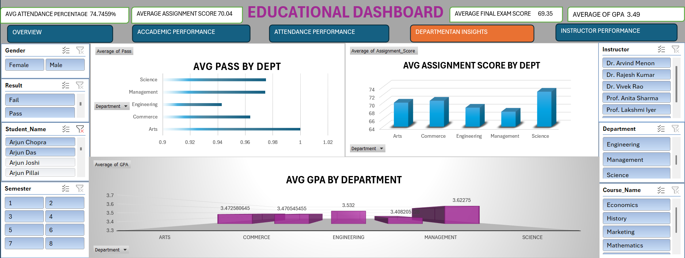
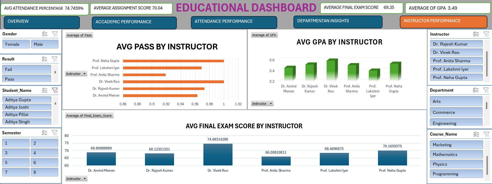

# Educational Analysis Dashboard

## Project Overview

An interactive Educational Analysis Dashboard developed using Microsoft Excel to analyze student performance, department-wise insights, and key academic metrics.

## Tools Used

- Microsoft Excel
- Pivot Tables
- Pivot Charts
- Slicers
- Timelines
- Data Cleaning
- KPI Analysis
- Data Visualization

## Key Features

- Student performance analysis
- Department-wise performance analysis
- Interactive KPI reporting
- Pivot-based data analysis
- Slicers and Timelines for interactive filtering
- Performance trend analysis
- Data-driven educational insights

## Dashboard Screenshots

### Dashboard Overview



### Student Performance Analysis



### Department Analysis



### KPI Analysis



### Performance Insights



## Project Objective

The objective of this project is to analyze educational data and present meaningful insights through an interactive Excel dashboard. The dashboard helps identify student performance patterns, department-level trends, and key performance indicators.

## Author

**Bharath A**

Aspiring Data Analyst  
Skills: Excel | SQL | Python | Power BI | Tableau
```

